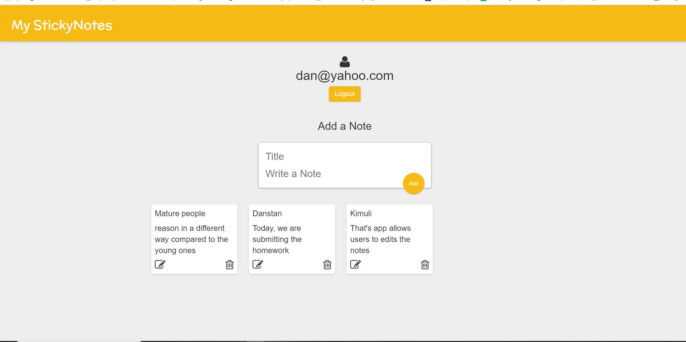

# Sticky Notes
Allows users to store edit and delete personal notes

## Link to Project
https://danstans-sticky-notes.herokuapp.com/

## How It's Made:
Tech used: EJS, Express.JS, NodeJS, Passport.JS & MongoDB

This is a CRUD application that leverages NodeJS with Express to operate the server. It uses Passport JS for managing the sessions once a user creates an account and logs in. The app utilizes MongoDB for storing the notes and the information for user authentication. I intended to make it simple whereby the user is able to add notes and delete them however I was able to add a functionality which enables a user to edit the note if they desire changes on it.

## Optimizations
I managed to make the app secure and each user has their information protected

You don't have to include this section but interviewers love that you can not only deliver a final product that looks great but also functions efficiently. Did you write something then refactor it later and the result was 5x faster than the original implementation? Did you cache your assets? Things that you write in this section are GREAT to bring up in interviews and you can use this section as reference when studying for technical interviews!

### Lessons Learned:
Complex working apps come in simple packages!
